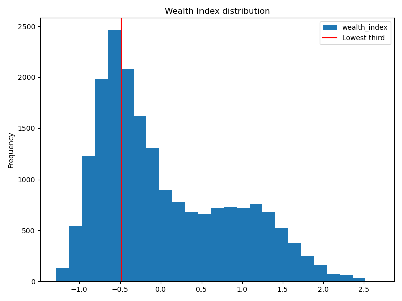

# Predicting-Poverty-with-Satellite-Images

## Authors: Stanley Azuakola, Atigon Hongchumpol, Simon Lazarus

---

# Executive Summary
We aim to predict whether a given village in Africa suffers from extreme poverty by using nothing other than the geographic coordinates of that village and satellite imagery that can be freely and automatically downloaded using those coordinates.  We train convolutional neural networks and use ensemble modeling techniques to develop a production model that correctly identifies extreme poverty in 79% of cases in which it appears (Recall = .79) while maintaining an overall predictive accuracy of 85% across all cases.

# Contents

### Jupyter notebooks
1. [Data collection](./code/01_download_tfrecords.ipynb)
2. [Extracting images and other data](./code/02_extract_images_and_data.ipynb) from downloaded files, and cleaning them
3. [Exploratory data analysis](./code/03_EDA.ipynb) of non-image data
4. [Baseline modeling](./code/04_Baseline_model.ipynb) that does not use satellite imagery
5. [Neural network modeling and training](./code/05_nn_modeling.ipynb)
6. [Final modeling](./code/06_final_modeling.ipynb) and analysis of our production model's performance

If using our pre-downloaded and pre-exported data, you can skip notebooks 1 and 2.

 ---

### Link to Google Drive for this project: https://drive.google.com/drive/folders/1KeMIB-QhPhGP0AuZkLqOln9NR1Cli-vD?usp=sharing

This project uses several gigabytes' worth of satellite imagery and other data.  See the Google Drive to access these data, or replicate the steps in our [first](./code/01_download_tfrecords.ipynb) and [second](./code/02_extract_images_and_data.ipynb) notebooks to download and export the data for yourself (this will take at least 12 hours).

---

### Software Requirements
- Python (Numpy, Pandas, Scikit-Learn)
- TensorFlow version > 2.0

# Introduction

In this project, we use satellite imagery from 23 countries in Africa combined with survey data about wealth and poverty to train machine learning models to predict whether a given area ("village") in Africa suffers from extreme poverty.  We use convolutional neural networks, transfer learning and ensemble modeling to develop a model that correctly identifies extreme poverty in 79% of cases in which it appears (Recall = .79) while maintaining an overall predictive accuracy of 85% across all cases.

This project was inspired by the [2020 *Nature Communications* paper of Yeh et al.](https://www.nature.com/articles/s41467-020-16185-w), whose [repository on GitHub](https://github.com/sustainlab-group/africa_poverty) contains many useful resources for getting started replicating their project or producing similar projects.  Considering the 2-week timeframe of our project, we borrow Yeh et al.'s code for downloading satellite imagery from [Google Earth Engine](https://earthengine.google.com/), with minor changes made by us to enable compatibility with TensorFlow versions > 2.0.  We also borrow their *Wealth Index* estimates - 1-dimensional continuous estimates of overall wealth/poverty extracted from the combination of many wealth-related survey questions - for the approximately 20,000 villages whose satellite images we employ.  Beyond the data-collection process, however, all work in this project is entirely original.

Using the Wealth Index as a measure of wealth, we seek to classify villages as either being in the *lowest third* of the wealth distribution or not.  The distribution of wealth (as measured by the Wealth Index) is pictured below; as one can see, it is bimodal.  The lowest third of this distribution represents those villages at or below the "left peak"; these villages are likely to be in the most dire need of aid.  We will say that a village suffers from *extreme poverty* if it falls in this lowest third of the wealth distribution.

When resources are limited and direct information about poverty is scarce, it would be quite useful to have a model that can accurately predict, from nothing but geographic coordinates and freely available satellite imagery, whether a given village suffers from extreme poverty.  Our production model aims to do just that.

# Model Selection Criteria and Baseline Models

We wish to develop a model that balances accuracy and Recall score.  Since two-thirds of villages do *not* fall in the bottom third of the wealth distribution, the null model - guessing that *every* village does not fall in the bottom third - achieves an accuracy of 67% but a Recall score of 0%.  A high recall score is important in order to ensure that the model does not fail to identify too many cases of extreme poverty; however, a high accuracy score is important to ensure that the model does not severely *overpredict* poverty.

In order to gauge the merits of using satellite imagery, we develop baseline models that are trained on nothing but the geographic coordinates of a village and the name of the country in which that village is located.  Our best-performing baseline model, a Random Forest model, achieves an accuracy score of 80% but a Recall score of only 67%.  Our production model, a Gradient-Boosted Decision Trees (XGBoost) model trained on the predictions of 6 convolutional neural networks that were trained on various satellite image channels, achieves a noticeably higher accuracy score of 85% and a much higher Recall score of 79%.

# Wealth Index Data

The Wealth Index data was borrowed from the [repository](https://github.com/sustainlab-group/africa_poverty) of Yeh et al.  Each observation in our data set represents a 3-year average of conditions realized by a particular geographic location for which [Demographic and Health Surveys (DHS)](https://dhsprogram.com/) data exists.  The DHS are standardized surveys that were conducted in 23 countries between 2009 and 2016; they contain survey questions about asset wealth.  These questions include assessments of the size and quality of housing, access to water and electricity, and ownership of vehicles and electronics.  The Wealth Index estimate is simply the first principal component of the combination of these survey scores.

In our data set, survey scores across individuals coming from the same "survey enumeration area" (approximately equivalent to a real-life village or neighborhood) were averaged together into a single Wealth Index score for that area.  Furthermore, to reduce noise in the wealth estimates (and in the satellite images; see below), each of these area-wide Wealth Index estimates were pooled across three years of surveys.  Thus, each observation in our data set - that is, each "village" - is really a 3-year average of conditions in a particular geographic location.  Each "village" represents either the period 2009-2011, 2012-2014, or 2015-2017; hence, the same geographic location may be entered as up to three separate observations in our data set provided separate survey data exist for that location during each of the periods 2009-11, 2012-14, and 2015-17.  These "repeated" observations still provide useful additional information, as poverty conditions in the developing world can change frequently and sometimes rapidly.  Thus, it is useful to think of each observation as its own distinct "village" even if some "villages" occupy the same geographic coordinates (but at different points in time).

# Satellite Imagery

For each of the 19,699 "villages" for which we have DHS data, we download 8 channels of satellite images from that location.  These channels include the standard RGB channels as well as three infrared channels (NIR, SWIR1, and SWIR2), a thermal channel (TEMP1) and a nighttime light channel (NIGHTLIGHTS).  The NIGHTLIGHTS images for the period 2009-2011 were captured by the DMSP satellite and are at 30 arc-second/pixel resolution, while the NIGHTLIGHTS images for the periods 2012-2014 and 2015-2017 were captured by the VIIRS satellite at a sharper 15 arc-second/pixel resolution.  All other image channels were captured by Landsat at 30 m/pixel resolution, representing a much higher-resolution image.  All images were downloaded at 255x255 pixel size.

Since each "village" represents a 3-year average of conditions, each image corresponding to a particular latitude and longitude is a composite of 3 years' worth of images.  Within each of the 8 image channels, a given pixel of the composite image is formed by taking the median of all values achieved by that pixel over the 3-year period in question *excluding days on which that pixel was covered by clouds*.  This process allows each of a village's 8 image channels to represent a different aspect of that village's average ground-level appearance over the 3-year period in question.

Nonetheless, for technical reasons a small number of images contain "bad RGB pixels" - pixels whose values are not between 0 and 1 like almost all other downloaded RGB pixels.  If a given "village" has any bad RGB pixels, we exclude that village from our data set.  Of the 19,699 "villages" originally in our data set, 19,467 remain after such eliminations.  For each of these villages, we export 6 image types: RGB, NIR, SWIR1, SWIR2, TEMP1 and NIGHTLIGHTS.  We then use these 6 types of images, along with data on latitude, longitude, and country (which can be derived from latitude and longitude) to train models to predict whether a given village falls in the poorest third of the Wealth Index distribution.

# Train/Test/Validate
Among the 19,467 observations in our data set, we reserve 5% (974 observations) for test data and 5% (973 observations) for validation data.  During the modeling process, we train our models on the 17,520 remaining "training" observations and select models based on their performance on the test data.  We do not use or examine the validation data other than to apply transformations (that were "fitted" without looking at the validation data) to them so that they are in the same format as the other data and can be inputted into our models (to produce predictions on them during the validation stage).  Finally, once we have selected our production model, we use the unseen validiation data to evaluate our model's performance and compare it to our baseline model that did not use satellite imagery.

# Modeling Strategy and Production Model

We use convolutional neural networks and transfer learning to extract wealth-related information from the satellite images associated with each village.  Specifically, we train the top layer of [`EfficientNetV2M`](https://keras.io/api/applications/efficientnet_v2/#efficientnetv2m-function) separately on each of the 6 different image types (RGB, NIR, SWIR1, SWIR2, TEMP1 and NIGHTLIGHTS).  That is, we create 6 different predictors of whether a given village falls in the poorest third of all villages: each predictor looks at a different type of image and outputs its estimated probability that the village in question comes from the poorest third of all villages.

None of these predictors is *indvidually* particularly accurate; accuracy scores on the test data range from 69% (NIR) to about 74-75% (RGB and NIGHTLIGHTS).  However, each one of these image types seems to convey *somewhat distinct information* about the village in question: the correlations between the 6 predictors' (probabilistic) predictions are all below .63, with the exception of two of the correlations between the three infrared channels' predictions.

With this in mind, in our [final notebook](./code/06_final_modeling.ipynb) we train models on the combination of the *predictions of the 6 image-based predictors* and latitude, longitude and country data for each village.  Our best-performing model, in terms of its accuracy and Recall scores on test data, is a Gradient-Boosted Decision Trees (XGBoost) model.  As mentioned above, it significantly outperforms our baseline model in terms of its accuracy and Recall scores on the unseen validation data.

# Conclusions

Measuring poverty can often be difficult and time-consuming, so it is useful to have models that can make reaonably accurate predictions about it.  Our work shows that it is possible to predict whether a village in one of 23 countries in Africa suffers from extreme poverty by using nothing but the geographic coordinates of that village and other information that can be automatically downloaded and given to our model.